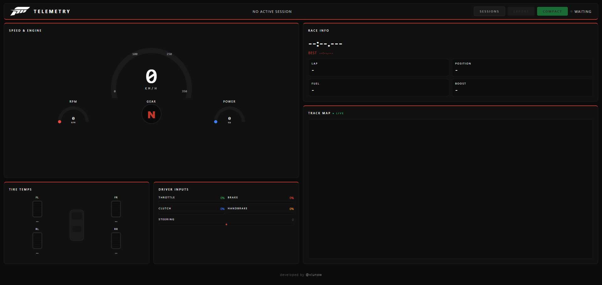

# FH6 Telemetry

A UDP telemetry receiver for Forza Horizon 6. It listens for the data the game broadcasts over the network, tracks your sessions and lap times, and serves a live dashboard in the browser.



## How it works

Forza Horizon 6 can stream telemetry packets over UDP while you're driving. This tool receives those packets, parses every field (speed, RPM, tire temps, inputs, position, etc.), groups them into sessions based on when the race flag goes on and off, and exposes everything through a small HTTP server.

The browser dashboard connects via Server-Sent Events and updates in real time. When a session ends, it's saved to disk as a JSON file you can analyze later.

## Setup

You need Node.js 18 or newer.

```
npm install
```

There are no runtime npm dependencies. The app uses only Node.js built-ins (`dgram`, `http`, `fs`). The packages installed are dev-only tools for bundling.

## Running

```
npm start
```

For development with auto-reload on file changes:

```
npm run dev
```

The server starts two listeners:

- UDP on port `20440` (game data)
- HTTP on port `3000` (open in a browser to see the live dashboard)

Both ports can be changed with environment variables.

**Linux/Mac:**
```
PORT=20777 HTTP_PORT=8080 npm start
```

**Windows (PowerShell):**
```
$env:PORT=20777; $env:HTTP_PORT=8080; npm start
```

## Quick start

### 1. Configure the game

In Forza Horizon 6, go to **Settings > HUD and Gameplay > Telemetry** and set:

| Field               | Value                                  |
| ------------------- | -------------------------------------- |
| Data Out            | **On**                                 |
| Data Out IP Address | `127.0.0.1` (same PC) or your local IP |
| Data Out IP Port    | `20440`                                |

If the game is on a console or a different machine on your network, use the local IP of the machine running this tool instead of `127.0.0.1`.

### 2. Run the app

Double-click the `.exe` file (or run `npm start`) and open in your browser:

```
http://localhost:3000/
```

## Dashboard

Open `http://localhost:3000` in a browser. You'll see:

- **Speed & Engine**: speedometer arc, RPM and power gauges, current gear
- **Tire Temps**: temperature per corner, color-coded (green is fine, yellow is getting warm, red is too hot)
- **Driver Inputs**: throttle, brake, clutch, handbrake bars and a steering indicator
- **Race Info**: current lap time, best lap, lap number, position, fuel, boost
- **Track Map**: live position tracking on the FH6 Japan map, with a trail per lap and a heading arrow

The header shows the active session ID and has three buttons:

- **Sessions**: opens a drawer listing all saved sessions; click any session to open the viewer
- **Export**: downloads the full current (or last closed) session as JSON
- **Compact**: downloads a compact version of the session (see [Compact export](#compact-export))

The dashboard only shows live data while a session is active (i.e., while the game's race flag is on).

### Session viewer

Clicking a session in the Sessions drawer opens a viewer with two tabs:

- **Charts**: speed, RPM, tire temperatures, and driver inputs plotted over the full session, plus a summary bar (max speed, max RPM, max power, best lap)
- **Replay Map**: the recorded track path color-coded per lap, with a playback slider and play/pause control

## Sessions

Sessions are saved automatically to the `sessions/` directory when a session ends. A session is only saved if it had at least one completed lap or more than 400 packets recorded.

File names follow the pattern `session_NNNN_<carOrdinal>.json`.

Each file includes:

- Session metadata (start/end time, car ordinal, class, PI)
- Lap times with formatted strings
- Aggregate stats (max speed, max RPM, max power, average fuel, max boost)
- The full packet log

You can also export the current active session at any time by hitting the **Export** button in the dashboard, or by calling `GET /export` directly. If no session is active, the endpoint returns the last closed session.

## Compact export

`GET /export-compact` returns a smaller structured file instead of the raw packet log. It contains four sections:

| Section    | Description                                                                                                                                                              |
| ---------- | ------------------------------------------------------------------------------------------------------------------------------------------------------------------------ |
| `summary`  | Single-record stats: max speed, max RPM, max power, max torque, max boost, max lateral/longitudinal G, average fuel, best lap, duration                                  |
| `lapStats` | Array of `{ lapNumber, lapTime }` for each recorded lap                                                                                                                  |
| `sectors`  | 10 equal-time sectors per lap, each with avg/max speed, avg/max RPM, avg throttle/brake %, avg G forces, avg tire temps per corner, avg boost, avg power                 |
| `samples`  | Downsampled packet data at ~1 sample/second (30:1 ratio): speed, RPM, power, torque, throttle, brake, gear, G forces, tire temps, boost, fuel, lap number, race position |

## HTTP endpoints

| Endpoint              | Description                                                                                              |
| --------------------- | -------------------------------------------------------------------------------------------------------- |
| `GET /`               | Live dashboard                                                                                           |
| `GET /events`         | SSE stream of raw telemetry packets                                                                      |
| `GET /status`         | JSON with current session state and SSE client count                                                     |
| `GET /debug`          | Diagnostic info — see below                                                                              |
| `GET /export`         | Download the current (or last closed) session as JSON. Accepts `?downsample=N` to keep every Nth packet. |
| `GET /export-compact` | Download a compact session summary with sectors and downsampled samples                                  |
| `GET /sessions`       | JSON array listing all saved sessions (metadata only, no packet data)                                    |
| `GET /session?id=N`   | JSON with the full saved session for the given ID                                                        |

### /debug

`GET /debug` returns a JSON snapshot useful for troubleshooting when no data appears in the dashboard:

```json
{
  "udpPort": 20440,
  "httpPort": 3000,
  "packetsTotal": 4312,
  "parseErrors": 0,
  "lastParseError": null,
  "lastParseErrorAgoMs": null,
  "lastPacketAgoMs": 120,
  "lastPacketMs": 1748555032481,
  "sseClients": 1,
  "sessionActive": true,
  "sessionId": 3,
  "currentSessionPackets": 1850,
  "currentSessionLaps": 2,
  "uptimeMs": 95400
}
```

| Field                | What to look for                                                                                    |
| -------------------- | --------------------------------------------------------------------------------------------------- |
| `packetsTotal`       | If this stays at `0` with the game running, UDP packets aren't arriving — check port and IP in game settings |
| `parseErrors`        | If this is climbing, packets are arriving but failing to parse — likely a packet size or format issue |
| `lastParseError`     | The error message from the most recent failed parse                                                 |
| `lastPacketAgoMs`    | Milliseconds since the last successfully parsed packet was broadcast; `null` means none yet received |
| `sseClients`         | Number of browser tabs connected to the SSE stream                                                  |

## Rewind handling

The session manager handles the game's rewind feature. If the race state drops and comes back within 30 seconds at a lower race time than where it left off, it treats that as a rewind rather than a new session and continues recording into the same file.

## Building the executable

To produce a standalone `fh6-telemetry.exe` that runs without Node.js installed:

```
npm run build
```

This bundles the source with esbuild and then uses Node.js SEA (Single Executable Application) to inject the bundle into a copy of the Node binary. The output is written to `dist/fh6-telemetry.exe`.

## Data fields

Every packet contains:

- Engine: RPM (current, idle, max), power (W), torque (Nm), boost
- Motion: speed (m/s and km/h), velocity (XYZ), acceleration (XYZ), position (XYZ), yaw/pitch/roll
- Tires: temperature (Celsius), slip ratio, slip angle, wear (if available in the packet)
- Suspension travel per corner
- Inputs: throttle, brake, clutch, handbrake (0–255), gear, steering (–127 to 127)
- Race: current lap time, best lap, last lap, race time, lap number, race position
- Car: ordinal ID, class, performance index (PI), drivetrain type
- Fuel level
- Distance traveled
